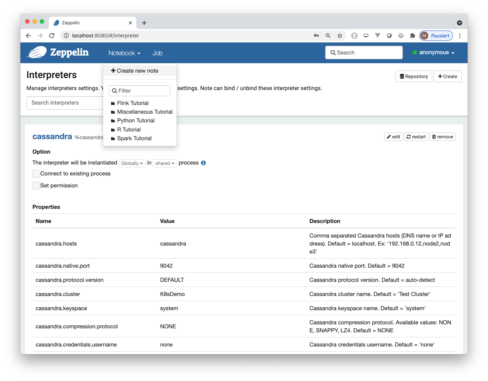
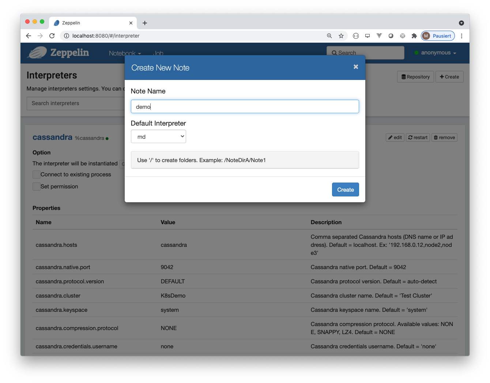

# Walkthrough for deploying Apache Zeppelin on Kubernetes

Apache Zeppelin is a *web-based notebook that enables data-driven,
interactive data analytics and collaborative documents with SQL, Scala and more.*

As a Data Scientist, I love Apache Zeppelin because of its versatility and flexibility - from a Kubernetes administrator's perspective, Zeppelin has given me some headaches.
However, in my opinion, this is not because Zeppelin's Kubernetes support is bad. 
Rather, I am not convinced by the current official documentation and the available sources on this subject, which brings us to the motivation for this article.


## Apache Zeppelin on Kubernetes

So, how does Zeppelin work on Kubernetes? Basically, the whole thing is based on simple principles:
there is a web server brought in as a Kubernetes deployment. While you are interacting with a Zeppelin note, the server creates pods for each of the interpreters in a lazy fashion. 
The interpreter pods all use the same image.

## Building and providing Images

That said, when it comes to building and providing the required images, the following implies: there is need for both an image containing the web server and another image used by the interpreter pods.
The creation of these images is typically done by multistage builds.
In this context, a common base image is utilized for both images, from which the relevant parts of Apache Zeppelin are taken. Accordingly, the first step of building the desired images is to provide said base image.

### Building the Base Image 

One option for providing the base image is to use the code from the official repository, which can be obtained by using git:

```bash
git clone https://github.com/apache/zeppelin.git
```

The Dockerfile suitable for building the base image is located directly in the root directory of the project. So, looks like you can get started right away, but before starting the build, you should consider the following aspects:

The base image contains the complete build of Zeppelin and is about 2GB in size. 
Therefore, the creation of the image will take some time. 
Furthermore, you have to make sure that Docker has enough resources available. If you are a Windows or Mac user, you may have to resize the virtual machine Docker is using.

This in mind, we can change to the root directory of the project and start the build. Thereby it makes sense to use the tag that is referred in the Dockerfiles of the said images inheriting from the base image:

```bash
cd zeppelin
docker build -t zeppelin-distribution:latest . 
```

### Building the Server Image

Apache Zeppelin's Github project provides some useful Dockerfiles. A Dockerfile for building the server image is located in the `scripts/docker/zeppelin-server` folder of the project.
Before the image can be built, a few adaptions may need to be made.

First thing to do is to set the version number of the distribution.
The version number of the distribution can be obtained by considering the war files in the base image:

```bash
docker run -i zeppelin-distribution:latest ls /opt/zeppelin
```

You can set the version number for the server image by changing the default value of the `value` argument in the Dockerfile, e.g. like this:

```dockerfile
ARG version="0.10.0-SNAPSHOT"
```

Another option is to add the version number as an argument to the docker build command (see below).

If you take a closer look at the Dockerfile, there are hints in the comments for how to configure the image. 
For example, you can determine that only certain interpreters are supported by the zeppelin server. 
According to the following example snippet, only support for JDBC, Markdown, Python and Cassandra will be integrated in the image:

```dockerfile
# Decide
## 1) Copy and activate all interpreters (default)
# COPY --from=interpreter-settings /opt/zeppelin/interpreter ${ZEPPELIN_HOME}/interpreter
## 2) Copy and activate only a specific set of interpreter
COPY --from=zeppelin-distribution /opt/zeppelin/interpreter/jdbc/interpreter-setting.json ${ZEPPELIN_HOME}/interpreter/jdbc/interpreter-setting.json
COPY --from=zeppelin-distribution /opt/zeppelin/interpreter/md/interpreter-setting.json ${ZEPPELIN_HOME}/interpreter/md/interpreter-setting.json
COPY --from=zeppelin-distribution /opt/zeppelin/interpreter/python/interpreter-setting.json ${ZEPPELIN_HOME}/interpreter/python/interpreter-setting.json
COPY --from=zeppelin-distribution /opt/zeppelin/interpreter/cassandra/interpreter-setting.json ${ZEPPELIN_HOME}/interpreter/cassandra/interpreter-setting.json
```

Since local files are involved, the build of the image has to be run from the corresponding folder.
Apart from that, you should tag the image to refer to the associated registry Kubernetes will access later on:

```bash
cd scripts/docker/zeppelin-server
docker build -t grothesk/zeppelin-server-custom:0.10.0-SNAPSHOT --build-arg version=0.10.0-SNAPSHOT .
```

Pushing the image to the registry then is done like this:

```bash
docker push grothesk/zeppelin-server-custom:0.10.0-SNAPSHOT
```

### Building the Interpreter Image

A corresponding Dockerfile for the interpreter image can be found in the `scripts/docker/zeppelin-interpreter` folder.
The procedure is very similar to the one dealing with the server image considered before:
the version has to be set and you have to choose which interpreters should be supported.

For example, if you want to provide support for JDBC, Markdown, Python and Cassandra the interpreter's Dockerfile should contain the following lines:

```dockerfile
# Decide:
## 1) Build a huge image with all interpreters (default)
# COPY --from=zeppelin-distribution /opt/zeppelin/interpreter ${ZEPPELIN_HOME}/interpreter
## 2) Build an image with only some interpreters
#### Copy interpreter-shaded JAR, needed for all interpreters
COPY --from=zeppelin-distribution /opt/zeppelin/interpreter/zeppelin-interpreter-shaded-${VERSION}.jar ${ZEPPELIN_HOME}/interpreter/zeppelin-interpreter-shaded-${VERSION}.jar
#### Copy specific interpreters,  replace "${interpreter_name}" with your interpreter. Of course you can repeat the line with defferent interpreter
COPY --from=zeppelin-distribution /opt/zeppelin/interpreter/jdbc  ${ZEPPELIN_HOME}/interpreter/jdbc
COPY --from=zeppelin-distribution /opt/zeppelin/interpreter/md  ${ZEPPELIN_HOME}/interpreter/md
COPY --from=zeppelin-distribution /opt/zeppelin/interpreter/python  ${ZEPPELIN_HOME}/interpreter/python
COPY --from=zeppelin-distribution /opt/zeppelin/interpreter/cassandra  ${ZEPPELIN_HOME}/interpreter/cassandra
```

If certain Python packages are required for the interpreter, these can be specified via `conda_packages.txt` or `pip_packages.txt`, located in the same folder as the Dockerfile.

After configuring the Dockerfile, building and deploying the image is done as usual:

```bash
cd scripts/docker/zeppelin-interpreter
docker build -t grothesk/zeppelin-interpreter-custom:0.10.0-SNAPSHOT --build-arg version=0.10.0-SNAPSHOT .
docker push grothesk/zeppelin-interpreter-custom:0.10.0-SNAPSHOT
```

## Deploying the Kubernetes resources

For the deployment of Zeppelin there is a yaml file in the project that contains the relevant manifests: `k8s/zeppelin-server.yaml`.
The customized images are referenced within the manifests as follows.

The name of the server image is inserted into the corresponding field of the deployment controller:

```yaml
apiVersion: apps/v1
kind: Deployment
metadata:
  name: zeppelin-server
  ...
spec:
  ...
  template:
    ...
    spec:
      ...
      containers:
      - name: zeppelin-server
        image: grothesk/zeppelin-server-custom:0.10.0-SNAPSHOT
```

The interpreter image is set in the ConfigMap `zeppelin-server-conf-map`:

```yaml
apiVersion: v1
kind: ConfigMap
metadata:
  name: zeppelin-server-conf-map
data:
  ...
  ZEPPELIN_K8S_CONTAINER_IMAGE: grothesk/zeppelin-interpreter-custom:0.10.0-SNAPSHOT
```

The ConfigMap `zeppelin-server-conf-map` is used to inject the included values as environment variables into the server container. 
Consequently, a restart of the server pods is necessary if the value of `ZEPPELIN_K8S_CONTAINER_IMAGE` has been changed.

Ok, let's get to the end: after configuring `k8s/zeppelin-server.yaml` you can deploy Apache Zeppelin like this:
```
kubectl apply -f k8s/zeppelin-server.yaml
```

And that's it.

## Deploying Apache Zeppelin on Minikube

Last but not least, here is a test run of the deployment using a Minikube cluster.
In this example, the required images are provided by my account on DockerHub. 

You can obtain the corresponding Dockerfiles and manifests here: [https://github.com/deepshore/walkthrough-for-deploying-apache-zeppelin-on-kubernetes](https://github.com/deepshore/walkthrough-for-deploying-apache-zeppelin-on-kubernetes).

These files were created according to the steps above.

First, we need a cluster that meets the performance requirements. 
The requirements depend strongly on the tasks that are to be performed by the interpreters.
For example, a fairly generously sized cluster could be laid out as follows:

```bash
minikube start -p zeppelin --driver=virtualbox --memory=6g --cpus=4 --disk-size=20000mb
```

To be able to test the Apache Cassandra support of the interpreter image, you should deploy Cassandra. 
Manifests for deploying Cassandra on Kubernetes can be taken from the said repo like this:

```bash
kubectl apply -f https://raw.githubusercontent.com/deepshore/walkthrough-for-deploying-apache-zeppelin-on-kubernetes/main/cassandra/cassandra-service.yaml
kubectl apply -f https://raw.githubusercontent.com/deepshore/walkthrough-for-deploying-apache-zeppelin-on-kubernetes/main/cassandra/cassandra-statefulset.yaml
```

Depending on the size of the interpreter image, lazy loading may lead to a timeout. 
In this case I recommend to load the image in advance. 
Using a Minikube cluster with one node, this can be done as follows:

```bash
eval $(minikube -p zeppelin docker-env)
docker pull grothesk/zeppelin-interpreter-custom:0.10.0-SNAPSHOT
```

As a next step, we kick off the deployment of Zeppelin:

```bash
kubectl apply -f https://raw.githubusercontent.com/deepshore/walkthrough-for-deploying-apache-zeppelin-on-kubernetes/main/k8s/zeppelin-server.yaml
```

After that we wait for the server to be ready by checking the pod status: 

```bash
kubectl get pods -w
```

In order to access the web service, port-forwarding can be used like this:

```bash
kubectl port-forward zeppelin-server-54c44df9bc-m7rsk 8080:80
```

When port forwarding is set up, we should be able to communicate with Zeppelin via `localhost:8080`:


The following pictures show the steps for configuring the Cassandra interpreter.
According to our Cassandra deployment, changes to the configuration only affects the `hosts` (*cassandra*) and `cluster` (*K8sDemo*) properties.


After the Cassandra interpreter has been configured, we create a new note like this:





In order to test different interpreters, we should add and run some paragraphs:


Finally, if we have a look at the pods, we can see that for each interpreter used, a corresponding pod has been created:

```bash
kubectl get pods
NAME                               READY   STATUS    RESTARTS   AGE
cassandra-0                        1/1     Running   0          52m
cassandra-hdwtrn                   1/1     Running   0          70s
md-gangug                          1/1     Running   0          80s
python-ocxhqu                      1/1     Running   0          76s
zeppelin-server-54c44df9bc-m7rsk   3/3     Running   0          18m
```

I am convinced that you can manage on your own from here on.

## Sources

* Docker Multistage-Builds: [https://docs.docker.com/develop/develop-images/multistage-build/](https://docs.docker.com/develop/develop-images/multistage-build/)
* DockerHub: [https://hub.docker.com/](https://hub.docker.com/)
* Zeppelin on Kubernetes: [https://zeppelin.apache.org/docs/0.9.0/quickstart/kubernetes.html](https://zeppelin.apache.org/docs/0.9.0/quickstart/kubernetes.html)
* Zeppelin on Github: [https://github.com/apache/zeppelin](https://github.com/apache/zeppelin)
* This Walkthrough on Github: [https://github.com/deepshore/walkthrough-for-deploying-apache-zeppelin-on-kubernetes](https://github.com/deepshore/walkthrough-for-deploying-apache-zeppelin-on-kubernetes)